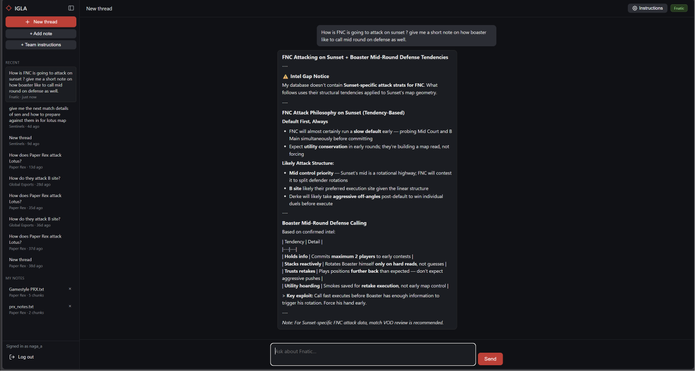
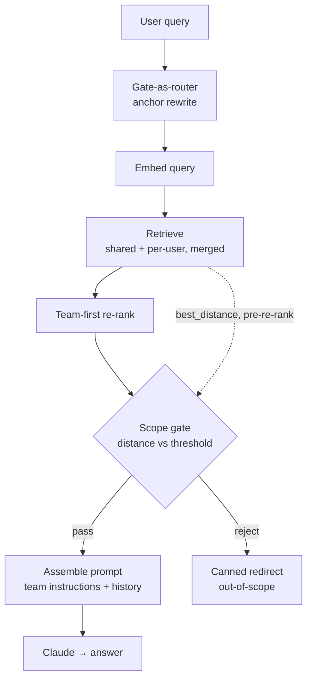

# IGLA — In-Game Leader AI

**Pre-match tactical intelligence for Valorant esports: a hand-built RAG pipeline with per-user vector isolation, scope-gated retrieval, and evals that test the full serving path.**

IGLA answers an in-game leader's pre-match questions — *"how does this opponent attack B on Lotus?"* — by retrieving scouting intel from a vector store, grounding a Claude prompt in it, and returning a tactical read. *(An IGL is a team's in-game shot-caller; before a match they need fast, specific intel on how the opponent plays.)* That's the domain. The rest of this README is about the engineering.

I hand-rolled the retrieval pipeline instead of using a framework, to work directly with the primitives — embeddings, re-ranking, scope thresholds, prompt assembly. Three decisions define the system:

- **The eval harness scores the served path, not just retrieval.** Testing retrieval alone misses whether the correct intel actually clears the scope gate to reach the model — so the evals measure both, which surfaced a gap between retrieval quality and what production would serve that a retrieval-only metric wouldn't show.
- **Isolation is structural, not filtered.** Each user's scouting notes live in a separate vector collection, so one opponent's data can't surface in another's answers — access is denied by which collection opens, not by a `WHERE` clause.
- **The model asserts only what the data contains.** Generation is separated from serving, with a human review gate before any generated intel enters the corpus.

The through-line is honesty: measure the real number, deny access by construction, keep the model grounded in what it can support.

## What it looks like



*A thread anchored to one opponent. The composer and badge track the team; answers are grounded in retrieved scouting intel.*

## How it works

The serving path for a single question:



The query is rewritten to the thread's anchored opponent, embedded, and matched against two merged vector collections — a shared scouting corpus and the user's private notes. A team-first re-rank surfaces the anchored opponent's intel; a scope gate then checks whether anything is actually close enough to answer. It reads `best_distance` *snapshotted before* the re-rank — the gate judges genuine relevance, not the reshuffled order. Pass, and the prompt is assembled with the team's standing instructions and conversation history; reject, and the user gets a redirect instead of a hallucinated answer.

## Three engineering decisions

### 1. The eval harness scores the served path, not just retrieval

Most RAG evaluation stops at retrieval: did the right document rank highly? That measures the retriever in isolation — not whether the correct intel survives the scope gate to reach the model as context.

IGLA's harness scores both. On a frozen golden set, retrieval **hit@1 was 67%** — the right intel ranked first two-thirds of the time. But **served@1 — whether that intel also cleared the scope gate to become context — was 44%.**

The gap was the finding. The scope gate was rejecting correctly-ranked matches that no retrieval metric was watching: retrieval succeeded, the gate dropped it, and only an eval applying the same gate the serving path applies could see it. An earlier version of the harness had scored retrieval rank alone — while production applied a distance cutoff the eval never saw — so the two silently diverged.

served@1 is threshold-bound, not a modeling wall: the current rank-1 rejects sit just past a scope threshold (0.75) that was tuned for an earlier embedding model's distance distribution. Recalibrating to 0.855 — validated on the frozen set, still below the off-topic rejection floor — recovers all three, taking served@1 to 67% and served@3 to 100% with no change to retrieval. The number is a documented, measured tuning frontier, and I know exactly which lever moves it.

### 2. Isolation is structural, not filtered

A user uploads private scouting notes. Those notes must never surface in another user's answers.

The common approach is a shared vector store with a `WHERE user_id = ?` filter on every query — one forgotten clause away from a leak. IGLA instead gives each user their own vector collection. A query merges the shared corpus with *that user's* collection and no other. Cross-user leakage isn't prevented by a filter that has to be correct every time; it's prevented because the other collection is never opened.

This is the repo's governing principle — impossible-by-construction over unlikely-by-discipline — applied in several places: per-user collections, server-side sessions over JWTs, and 404-not-403 responses so the API never reveals whether a resource it won't show you exists.

### 3. The model asserts only what the data contains

A tactical-intel LLM that invents specifics is worse than useless — it's confidently wrong to someone about to make a match-day decision.

So generation is separated from serving. Strategy documents are LLM-generated offline, pass through a human review gate, and only then enter the corpus — never written straight to the store at request time. At serving time the model is instructed to ground every claim in retrieved intel; when nothing relevant is retrieved, the scope gate returns a redirect rather than letting the model fill the silence. The model is a court reporter, not a novelist.

## What I built instead of a framework

"Hand-rolled" means the RAG pipeline is assembled from named components I control directly, not orchestrated through an abstraction layer. Each stage is a small, testable unit:

| Stage | Implementation |
|---|---|
| Embedding | `sentence-transformers` (all-mpnet-base-v2, 768-dim), called directly |
| Vector store | ChromaDB, one collection per user + a shared corpus |
| Retrieval + re-rank | Custom merge of shared and per-user results, team-first re-ranking |
| Relevance gate | Scope threshold on `best_distance`, snapshotted pre-re-rank |
| Prompt assembly | Standing per-team instructions + windowed conversation history |
| Generation | Anthropic SDK (Claude), called directly |
| Serving | FastAPI, server-side sessions, per-user scoping enforced at the DB |

Every stage is independently unit-tested and independently swappable.

### Why not LangChain / LangGraph

For a pipeline this shape — one retrieval step, one re-rank, one gate, one generation call — an orchestration framework isn't necessary, and it adds an abstraction layer between me and the exact behavior I need to debug: what got retrieved, what distance the gate saw, what went into the prompt. LangChain's value is composing many chained steps across swappable providers; IGLA has a small, fixed pipeline and one provider, so that value doesn't apply here, while the cost — indirection over the parts I most need to inspect — does. Direct calls kept the retrieval and gating logic legible enough that the served-vs-retrieved eval gap was *findable*; behind a chain abstraction, that silent failure is harder to see.

### Other deliberate omissions

- **No GraphRAG** — the corpus is per-team scouting intel, not an entity graph; graph traversal solves a retrieval problem this data doesn't have.
- **No LLM gateway / model routing** — one model, one provider. A routing layer is infrastructure for a problem I don't have yet.
- **No prompt caching** — Claude's cache floor is 1024 tokens; the assembled system prompt is well under that, so `cache_control` would be inert. Not adding it (and knowing why) is the correct call.

## Stack

**Pipeline** (see the table above): `sentence-transformers`, ChromaDB, Anthropic SDK (Claude), assembled directly.

**Application & serving**
- **FastAPI** — REST API, server-side sessions (revoking a session is deleting a row, not blacklisting a JWT)
- **PostgreSQL 16** via Docker Compose — users, conversations, per-team standing instructions
- **SQLAlchemy 2.0 + Alembic** — ORM and migrations
- **bcrypt** — password hashing
- **slowapi** — IP-based rate limiting
- **Python 3.13**

**Testing & evaluation**
- **115 tests** (unit + integration), pytest
- **Frozen golden-set eval harness** — hit@k / served@k on the full serving path (see [Evaluation](#evaluation))

**Frontend**
- Single-file vanilla JS — no build step, no framework. A hand-written sanitizing markdown renderer (builds DOM nodes directly, never `innerHTML`) keeps retrieved and generated content from becoming live markup.

The choices skew boring on purpose: server-side sessions over JWTs (a single replica gains nothing from stateless tokens; revocation is trivial), Postgres over anything exotic, no frontend framework for a UI this size. Boring-where-it-can-be-boring is what leaves attention for the parts that aren't.

## Evaluation

The eval harness answers one question honestly: *does the system serve the right intel?* — not *does the retriever rank it well?* Those are different questions, and conflating them is how RAG systems pass their tests and fail their users. The harness calls no model; it scores retrieval and the scope gate, so a bad end-to-end answer can be attributed to retrieval or generation separately.

**Metrics**, on a frozen golden set of nine analyst-style queries with verified answers:

| Metric | Score | Meaning |
|---|---|---|
| hit@1 | 67% | Correct intel ranked first |
| hit@3 | 100% | Correct intel in the top 3 |
| served@1 | 44% | Correct intel ranked first **and** cleared the scope gate |
| served@3 | 67% | Correct intel in the top 3 **and** cleared the gate |

`hit@k` measures retrieval; `served@k` adds the scope gate — whether production would actually surface that intel to the model. **hit@3 100% / served@3 67%** is the gap in one line: the right intel is always retrievable, but the gate drops some of it before it becomes context. That gap is the tuning surface, and it's visible only because the harness applies the same gate the serving path applies.

**Discipline that keeps the numbers honest:**

- **The eval applies production's gate.** `served@k` calls the exact `passes_scope_gate()` function the serving path uses. Before that, the eval scored rank while production applied a distance cutoff the eval never saw — the two silently diverged. An eval that doesn't share production's decision logic is measuring a fiction.
- **The golden set is frozen and held out.** Answer keys are verified from evidence before measuring, and the set is never edited to recover a number — a change is judged by its effect on the whole set, not the one query it targeted.
- **Threshold and embedder are a coupled pair.** A distance threshold is only meaningful for the embedding distribution it was tuned on, so the served@1 gap is a calibration artifact (0.75 predates the current model), not a retrieval failure — recalibrating to 0.855 recovers it.
- **Modal, not best-print.** Repeated runs vary by up to one query from a cross-process near-tie; the reported 67% hit@1 is the modal result across runs, not the single run that printed 78%.

Full per-query breakdown, both thresholds, and the determinism analysis: [`EVAL.md`](EVAL.md).

## The failure doesn't look like its cause

The same pattern kept recurring across this build: the symptom pointed nowhere near the root, and chasing the symptom was always wrong. Naming the pattern is how I stopped repeating it. Three instances:

**Retrieval work that never reached the serving path.** The evals said retrieval was strong. The app served weak answers. The instinct was to blame retrieval quality — embeddings, chunking, the re-rank. The actual cause: the eval was scoring retrieval rank while production applied a scope-gate the eval never measured, so retrieval improvements were real *and* invisible to users at the same time. The lesson became a rule: **an eval that doesn't apply production's decision logic is measuring a fiction** — which is why the harness now shares the scope-gate function.

**A threshold that "broke" when nothing about it changed.** After an embedding-model change, the scope gate started rejecting good matches. The threshold value was untouched — so the threshold looked innocent. But a distance threshold isn't a constant; it's a constant *relative to an embedding model's distance distribution*, and that distribution had shifted underneath it. The threshold didn't change and was still wrong. Threshold and embedder are a **coupled pair** — they move together or the gate silently miscalibrates.

**Tests passing against a server that wasn't running.** A test run went green while the code under test was broken. The cause: an orphaned `uvicorn` process from an earlier session still held the port, so the tests hit a *stale* server while the freshly-started one crashed on bind — unnoticed. The passing tests were real; they were testing the wrong process. The lesson is the one I now apply everywhere: **verify the running artifact, not the source** — a green check against the wrong process is worse than a red one.

The thread through all three: the system lies to you in the direction of your assumptions. The eval assumed retrieval was the product. The threshold assumed its own stability. The tests assumed the server was the one they meant. Every real bug in this project was found by distrusting a signal that looked fine.

## Running it locally

Requires Docker and Python 3.13.

```bash
# 1. Start Postgres
docker compose up -d db

# 2. Install dependencies
python -m venv venv
source venv/bin/activate        # Windows: venv\Scripts\activate
pip install -r requirements.txt

# 3. Configure — copy the example and add your Anthropic API key
cp .env.example .env

# 4. Seed the vector store (run once)
python ingest.py

# 5. Run
uvicorn api:app
```

Open `http://127.0.0.1:8000`, create an account, and start a thread against an opponent.

**Tests:**
```bash
pytest -m "not integration"     # unit
pytest                          # full suite
```

**Evals:**
```bash
python -m evals.run_eval                    # deployed threshold (0.75)
python -m evals.run_eval --threshold 0.855  # recalibrated cutoff
```

## Known limitations

Documented honestly, because knowing a system's edges is part of building it.

- **served@1 is a tuning frontier.** 44% at the deployed scope threshold (0.75); recalibrating to 0.855 recovers it to 67% on the frozen set (validated, not yet promoted to the deployed default). Calibration work, not a modeling wall — see [Evaluation](#evaluation).
- **Two jargon queries land at rank 2, not rank 1.** `entry fragger` and `primary initiator` retrieve the correct player into the top 3 (hit@3 is 100%) but not as the single top result — closing that gap is embedding-quality work, tracked rather than hand-tuned to pass the set. A third probe, `main controller`, is ill-posed for a roster that runs two controllers: there's no single ground-truth answer.
- **The markdown renderer handles a bounded subset.** Paragraphs, bold, italic, lists, headings, code, and links render; tables and code fences degrade to plain text. This is deliberate — the renderer builds DOM nodes directly and never touches `innerHTML`, so no retrieved or generated content can become live markup. Table support is a scoped future addition, not a fix.
- **Cold-boot latency.** ChromaDB's default embedding model re-downloads (~8s) on a cold boot because its cache path isn't configurable; no effect on warm restarts or request latency. Tracked, deferred to the embedding-model upgrade.
- **Not deployed to a live URL.** The portfolio value here is the repository, the eval discipline, and the architecture — not a warm server idling at cost. It redeploys in minutes for a live demo.

## Data

Scouting intel is sourced from `vlrdevapi`, an unofficial community API for Valorant match data — labeled as such and used only for this non-commercial portfolio project. Team and player data is public competitive-match information. Generated strategy documents pass through a human review gate before entering the corpus; no intel is written to the store unreviewed.