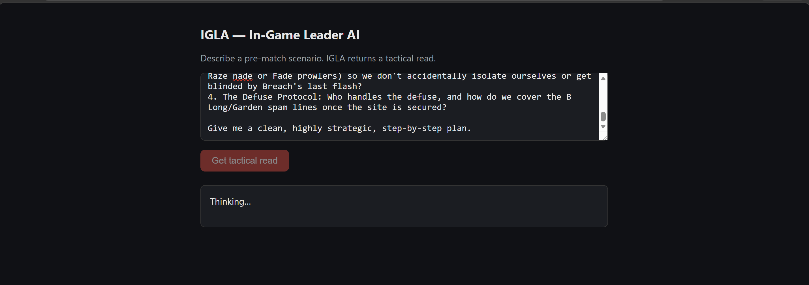
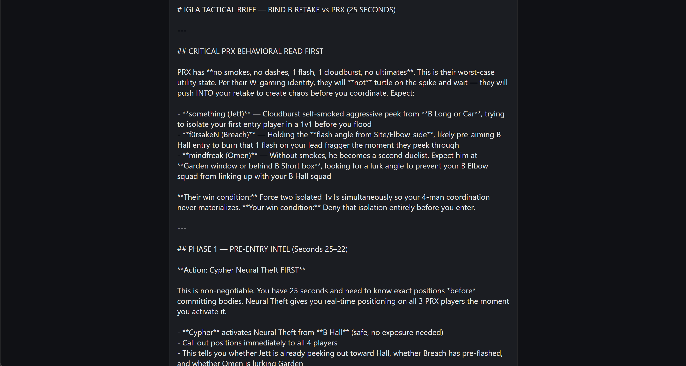
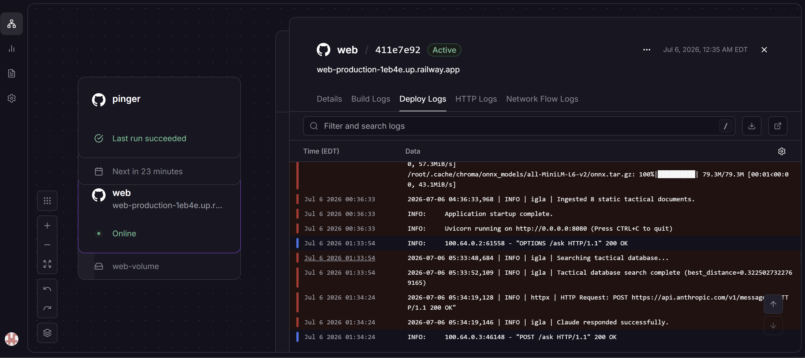

# IGLA — In-Game Leader AI

Pre-match tactical intelligence for Valorant esports. Describe a scenario in
plain English and get a scouting report grounded in real opponent data.

Most teams below the top tier don't have a dedicated analyst desk. IGLA is a
stand-in for one: an analyst types a situation, the system pulls the relevant
opponent intel out of a vector database, and Claude writes it up as a structured
dossier. It's for prep, not live coaching — you use it before the match, not
during the round.

Repo: https://github.com/412-Raghav/IGLA-ai

## What retrieval actually does, measured

A working RAG demo is easy. A trustworthy one is the hard part, and the only way
to know which one you have is to measure it. IGLA has an evaluation harness that
scores retrieval against a frozen set of analyst queries, and the headline
numbers are the honest ones:

| Metric | Result | What it means |
|--------|--------|---------------|
| Retrieval hit-rate@1 | **67%** | The single best document was ranked first |
| Retrieval hit-rate@3 | **100%** | The correct document was in the top 3, every query |
| Served@1 (deployed threshold) | **44%** | ...and survived the scope-gate to reach the analyst |

That third row is the interesting one, and it's why this section leads the
README instead of the demo. **Retrieval finds the right answer 67% of the time,
but the deployed system only serves it 44% of the time** — a 23-point gap. Every
prior metric reported the 67% and stopped. The 44% was invisible until the eval
was taught to apply the exact scope-gate that production applies.

The gap isn't a retrieval failure. It's a *threshold* miscalibrated to its
embedder — three correct, top-ranked retrievals sit just past a distance cutoff
that was tuned for a different embedding model. The fix is a recalibration, and
why it isn't live yet is itself a deliberate call (see
[The staged fix](#the-staged-fix-and-why-its-batched) below).

Full per-query results, distances, and the failure analysis are in
[`docs/EVAL.md`](docs/EVAL.md).

## Demo

Describe a pre-match scenario in plain language:



IGLA returns a structured tactical read. The opponent's behavioral profile is
pulled from the knowledge base; the step-by-step plan is the model reasoning over
that profile.



The full request path is visible in the logs — the scope-gate distance, the
model call, and the response — captured from the running deployment:



## How it works

You send a natural-language situation and the id of the team you're scouting. The
retriever finds the most relevant documents for that team, that context gets
attached to the prompt, and Claude answers using it. The interesting parts are
what's in the database and how retrieval is kept honest.

The store holds three kinds of document, all tagged by where they came from:

- **Live player stats** scraped per team from a community stats site — agent
  usage, roles, firepower, refreshed on a schedule.
- **Generated team briefs** — one per team, written by Claude at build time from
  a fact sheet assembled out of those stats.
- **Hand-curated intel** — the deeper, specific tactical notes that a human
  analyst would write.

Retrieval is scoped by team. A query about one opponent only searches that
opponent's documents plus a shelf of universal theory (agent combos, timing
principles), so a twelve-team corpus doesn't turn into twelve teams of noise.

## Engineering notes

The parts worth calling out, since a working RAG demo is easy and a trustworthy
one isn't.

### The eval measures what production serves, not a parallel copy

The scope-gate — the rule that decides whether the closest retrieved document is
relevant enough to answer at all — is defined once, in a single function that
both the serving path and the evaluation harness import. This is the reason the
44%/67% gap above could be found: before the gate was shared, the eval scored
*retrieval rank* while production applied a *distance cutoff* the eval never saw.
The two silently measured different things. An eval that doesn't call the code
production calls isn't measuring your system — it's measuring a fiction that
happens to resemble it.

The harness runs without calling the model, so a bad answer can be blamed on
retrieval or on writing, separately. It reports two numbers per cutoff:
hit-rate@k (did retrieval rank the right doc?) and served@k (did that doc also
clear the scope-gate?). The distance between them is the eval-vs-prod gap, made
visible instead of assumed.

### Grounding the generator by construction

Asking a model to "only use these facts" and hoping is not a plan. A generator
staring at a thin prompt will fill the gaps from its own training data and hand
it to you as if it were real intel.

So the generated team briefs are grounded structurally, not by request. The model
never sees the raw stats or anything else — it sees a single fact sheet built in
plain Python, containing only what the stats actually support: role composition,
agent pools, who carries by rating and combat score, and which players have too
little data to judge. If a fact isn't on the sheet, the model has nothing to draw
on to state it. A system prompt on top forbids it from asserting anything the
stats can't contain (map calls, economy reads, round tendencies) and from
dressing up its general Valorant knowledge as team-specific analysis.

Generation runs at temperature 0. For a grounded writer, variety is the failure
mode — every bit of sampling randomness is a chance to wander off the sheet.

### A human gate that actually caught things

Nothing generated gets embedded without a person reading it first, against the
exact fact sheet it was written from (the sheet is frozen and stored next to the
output for that reason — stats drift, so the doc is judged against its own source,
not a fresh pull).

This isn't ceremony. The gate caught a brief that invented a roster structure the
data contradicted, and another that called two different players the team's
highest-rated in the same breath. Both were real errors that would have gone into
the database silently otherwise. Both got fixed at the prompt level and
regenerated.

### Same model, two jobs, opposite risk

At query time Claude reasons over documents that retrieval already pinned — it
can't invent opponent intel, because the facts are in front of it. At build time,
generating briefs from sparse input, it can invent freely. Those are two
different risk profiles from one model, and the build-time path is why the fact
sheet, the contract, and the human gate all exist. The query path doesn't need
them; the generation path can't do without them.

### The generator never touches the serving path

Generation is a manual step an operator runs when a roster changes. The output is
reviewed, committed, and loaded as cached text. The daily refresh re-scrapes stats
and re-embeds them locally — it spends zero LLM tokens. The serving code doesn't
import the generator at all. The cost model was a design decision, not an
afterthought: putting generation inside the refresh would have quietly turned a
free daily job into a paid one.

### Retrieval improvement was measured, not hoped for

Top-1 retrieval was moved from a MiniLM baseline by injecting derived role
metadata into the documents — a game-wide agent-to-role mapping that lets a
jargon query like "best duelist" find a raw stat line it shares no words with.
That's a measured improvement from a cheap technique, which reads better than
swapping in a bigger model and hoping. The held-out golden set was never edited
to recover a number — editing the test to pass it measures nothing — and it
caught a real regression where a fix that helped one query broke another.

One honesty note the harness itself surfaced: on a nine-query set, single runs
vary by up to one query between processes, because two similarly-distanced
documents can tie for the top rank. The reported 67% is the modal result across
repeated runs, not a single lucky print. Variance on a small eval is a real
thing, and pretending a one-off number is stable is how eval theater starts.

### Guardrails

Three layers, each doing one job, described by what they actually do rather than
what sounds good:

- A **scope-gate** rejects anything that isn't a tactical question before the
  model is ever called, based on how far the closest document sits from the
  query. It doubles as a free spam filter — off-topic input is turned away for
  zero tokens, before any model call.
- User input and retrieved context are wrapped in **delimiters** that tell the
  model to treat them as data, not instructions. This is hygiene, not a wall —
  prompt injection isn't a solved problem industry-wide, and this doesn't pretend
  to solve it.
- **Rate limiting** on the query endpoint, in-memory and single-instance. A known
  limitation is documented below: behind the platform's edge proxy the limiter
  keys on a rotating internal address rather than the real client, so it throttles
  bursts but is not true per-client limiting. The honest fix (trusting forwarded
  headers, or a shared store) is scoped rather than claimed as done.

## The staged fix, and why it's batched

The repository is ahead of what was last deployed, on purpose. The deployed
service runs the older embedding model against a threshold calibrated for it. The
staged changes — a stronger embedding model, a recalibrated scope-gate, and the
required-`team_id` scoping that wires nine phases of retrieval work into the
serving path — are verified locally but held as a single batched deploy rather
than shipped piecemeal.

The reason is that they're coupled. Scoped retrieval searches a subset, so its
distances run higher than the unscoped path's; deploying it under the *old*
threshold would reject correct answers that the old distances would have passed.
The threshold and the embedder are a pair — changing one without the other makes
production strictly worse. So: a commit is a unit of reasoning, and each of these
is committed separately with its rationale; a deploy is a unit of risk, and these
ship together or not at all.

This is the honest state of a portfolio project: the engineering is done and
measured, and the production cutover is a single deliberate step rather than a
drift of half-changes.

## Tech stack

| Layer         | Choice                                        |
|---------------|-----------------------------------------------|
| Language      | Python 3.13                                   |
| LLM           | Anthropic Claude (Sonnet)                     |
| Vector DB     | ChromaDB (local, persistent)                  |
| Embeddings    | all-MiniLM-L6-v2 (deployed) / all-mpnet-base-v2 (staged) |
| API           | FastAPI + Uvicorn                             |
| Data source   | Unofficial community Valorant stats client    |
| Deployment    | Railway (web service + separate cron service) |

Dependencies are pinned to exact versions so the build is reproducible.

## Running it locally

```bash
python -m venv venv
venv\Scripts\activate           # Windows
pip install -r requirements.txt
```

Set your Anthropic API key in a `.env` file, then populate the database:

```bash
python ingest.py
```

Query it directly:

```bash
python main.py
```

Or run the API:

```bash
uvicorn api:app --reload
```

Run the retrieval eval (no model calls, no tokens spent):

```bash
python -m evals.run_eval                    # scores against the config threshold
python -m evals.run_eval --threshold 0.855  # scores against an alternate cutoff
```

## API

```
POST /ask
{ "situation": "how should we defend against a fast B execute", "team_id": 624 }
```

`team_id` is required and validated against the tracked-team registry — an
untracked id is rejected at the API boundary rather than degrading into a
misleading scope-gate rejection. `GET /teams` serves the registry for a client
picker. `GET /health` is an unauthenticated liveness check. Refreshing the live
data is behind a secret-protected endpoint, triggered on a schedule by a separate
cron service rather than an in-process timer.

## Limitations, and what was done about them

Every real system has edges. These are IGLA's, and what each one got instead of
being ignored.

**The eval-vs-prod gap.** Covered up top because it's the most important one:
retrieval ranks correctly more often than the deployed threshold lets through.
Found by the harness, quantified (67% vs 44%), and traced to a threshold-embedder
mismatch rather than hidden. The fix is staged; see above.

**Rate limiting behind an edge proxy.** The in-memory limiter keys on the client
address the app sees, which behind the deployment platform's proxy is a rotating
internal IP, not the real client. It throttles burst abuse but is not true
per-client limiting. Diagnosed from production access logs. The fix — configuring
the server to trust forwarded headers, and/or a shared store for multi-instance —
is scoped as real work, not claimed as done.

**Data freshness.** Rosters and stats come from a community site, and that feed
can lag reality — a benched or newly-signed player might linger in a team's
profile, or not appear yet, for a while after a change. The stats window is also
wide enough that experimental play at exhibition events can colour a team's
tendencies. The time window is a parameter you can tighten during active season,
and the pre-match framing means the analyst reading the report already knows
who's actually playing. The proper fix — cross-checking a second source and
reconciling disagreements — is genuinely its own piece of work (matching one
player across two sites is harder than it looks), scoped as a future phase instead
of bolted on badly.

**Retrieval on jargon-heavy queries.** The retriever sometimes ranks a general
tactical document above the specific answer, because the embedding model treats
dense tactical vocabulary as broadly relevant. The harness found it; the cause
was diagnosed (universal theory documents sit in every team's candidate pool and
out-rank team-specific ones on shared keywords). Two fixes are on the table: the
team-first re-rank already in place, which recovers hit-rate@3 to 100%, and a
stronger embedding model validated against the same harness. Documented and
measured rather than patched in a hurry that could regress other queries.

**Scope.** Pre-match only. It doesn't do live in-round coaching and isn't meant
to.

**No SLA on the data source.** The stats client is an unofficial community
project. Coverage is good, but if the underlying site changes, ingestion needs
updating.

## What's next

- Letting users upload their own scouting notes and scrims into a team's context.
- A focus control so an analyst can point the system at one opponent and steer the
  prompt from the UI.
- User accounts, so history and per-user on-demand refresh become possible.
- Cross-source data integrity — reconciling the stats feed against a second source
  to catch the roster-lag problem above.
